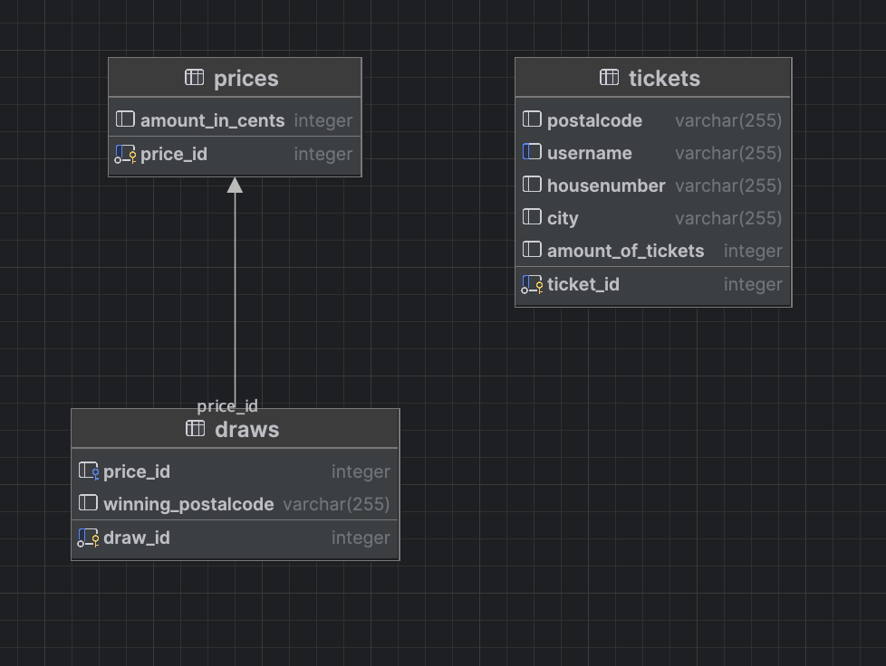

# Frontend Assessment

Welcome to the lottery assessment! In this repository you will find 2 projects.

Containing a backend and a frontend project, the backend is already implemented since this is a frontend assessment.

## Getting Started (Frontend)

1. **Install dependencies:**

   ```sh
   cd frontend
   npm install
   ```

2. **Start the frontend app:**

   ```sh
   npm run dev
   ```

3. **API Base URL:**
   - The frontend communicates with the backend at `http://localhost:3000/api`.
   - The backend must be running for the frontend to function correctly.

## Backend

The backend is a project build with [HonoJS](https://hono.dev/), a small backend framework inspired by Express. Is also has a docker-compose.yml file. This file will setup a postgress Database and seed it with some fake data.
Here you can see the ERD:



- The backend is already implemented and documented.
- For API endpoints, usage, and documentation, see [`backend/README.md`](./backend/README.md).
- Interactive API docs: [http://localhost:3000/api/ui](http://localhost:3000/api/ui)

## The assignment

At the Lotteries we have tickets, draws that select a ticket for the win and ofcourse PRIZES!!!! It is your job to make it
possible to make people win by writing a draw engine. The stack selected is the one you will work in. Thats:

- React
- Tailwind
- Typescript

You are free to select other tools as you go but these should be in the end result.

### Business rules

Prizes are shared across a postcal code, so the total prize will always be devided by the amount of tickets that match the drawn postcode. This means:

- If a prize has been selected and multiple people have the same postal code and just one ticket, the prize will be equally divided by the amount of people within the selected postal code.
- If a prize is won by multiple people and some winners have more than one ticket, they get a bigger share of the prize.

### Features

- Must be able to initiate draws
- Must be able to show the winner
- Must have multiple pages so we don't show one page that is extremily busy
- The won prizes should be correctly calculated
- Prizes should have an overview so people can see what they can win
- Could look like a product from the Lotteries

## Side notes

- Not everything has to be finished but the draw engine should work, that's the most important part.
- Think about A11y (WCAG 2.1 AA)
- Tests are encouraged and a big plus.
- You can spend as much time on as you like but the time invested should be reflected in the end result
